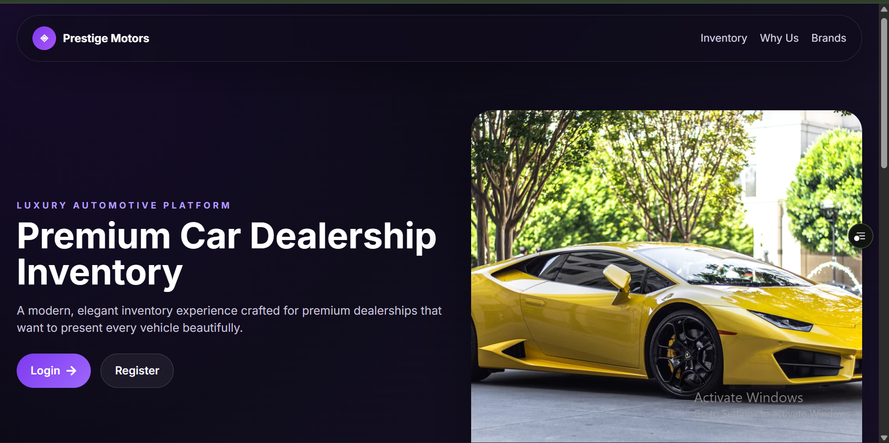
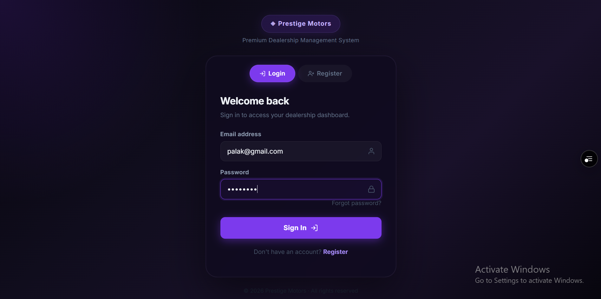
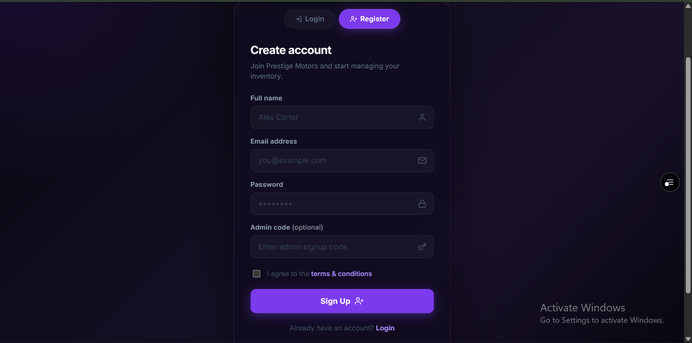
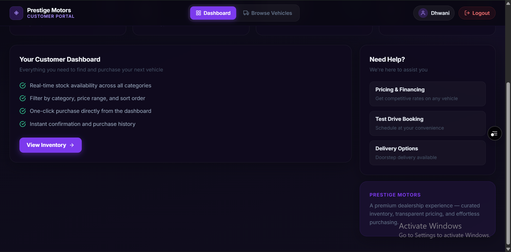
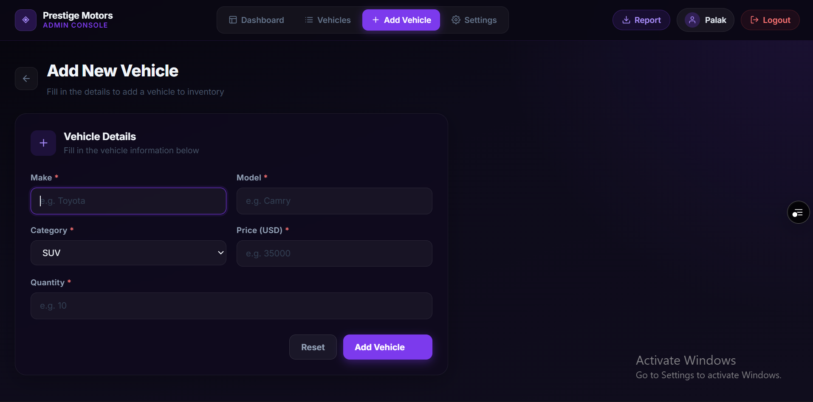
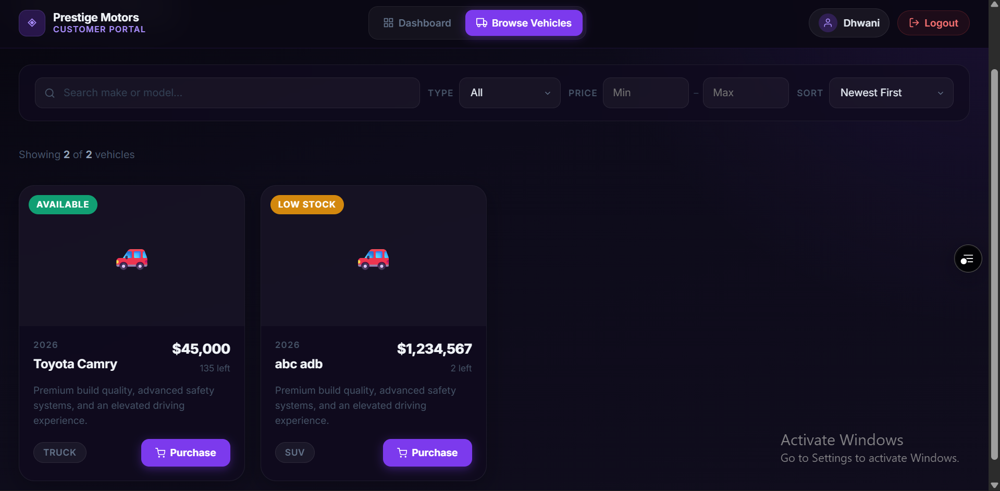

# 🚗 Prestige Motors - Car Dealership Inventory System

A full-stack Car Dealership Inventory System built using **React**, **Node.js**, **Express**, and **MongoDB** following **Test Driven Development (TDD)** principles and modern software engineering best practices.

> This project demonstrates production-quality backend architecture, REST API development, authentication & authorization, inventory management, automated testing, Docker containerization, deployment, and responsive frontend development.

---

# 📌 Live Demo

### 🌐 Frontend (Vercel)

**<YOUR_FRONTEND_URL>**

### 🚀 Backend API (Render)

**<YOUR_BACKEND_URL>**

### 📂 GitHub Repository

**<YOUR_GITHUB_REPO_URL>**

---

# 📖 Project Overview

Prestige Motors is a modern Car Dealership Inventory Management System that allows dealerships to manage vehicle inventory while enabling customers to browse and purchase vehicles securely.

The application supports two different user roles:

- 👤 Customer
- 👨‍💼 Administrator

Both roles have different permissions enforced using JWT Authentication and Role-Based Authorization.

---

# ✨ Features

## Authentication

- User Registration
- User Login
- JWT Authentication
- Password Hashing using bcrypt
- Protected Routes
- Role Based Authorization
- Admin Secret Key Registration

---

## Vehicle Management

Administrators can

- Add Vehicles
- Update Vehicle Details
- Delete Vehicles
- Restock Inventory
- View Inventory

Customers can

- Browse Vehicles
- Search Vehicles
- Purchase Vehicles

---

## Search

Search vehicles using

- Make
- Model
- Category
- Price Range

---

## Inventory

Inventory automatically updates after purchases.

Features include

- Purchase Validation
- Stock Management
- Restock Vehicles
- Out of Stock Handling

---

## Notifications

Email notifications for

- Vehicle Purchases
- Low Stock Alerts

---

## Security

- JWT Authentication
- Password Hashing
- Protected APIs
- Role Based Authorization
- Request Validation using Zod
- Helmet Security Middleware
- CORS Configuration

---

## Frontend

Modern responsive interface built using React.

Features include

- Landing Page
- Login
- Registration
- Customer Dashboard
- Admin Dashboard
- Vehicle Management
- Search & Filtering
- Protected Routes
- Responsive Design
- Dark Theme UI

---

# 🏗 Architecture

The backend follows a layered architecture.

```
Controller
      │
      ▼
Service Layer
      │
      ▼
Repository Layer
      │
      ▼
MongoDB
```

Additional layers

- DTOs
- Middleware
- Validators
- Utilities
- Shared Error Handling

---

# 🛠 Tech Stack

## Frontend

- React
- React Router
- Axios
- Zustand
- React Query
- Vite
- CSS

---

## Backend

- Node.js
- Express.js
- MongoDB
- Mongoose
- JWT
- bcrypt
- Zod
- Nodemailer

---

## Testing

- Jest
- Supertest

---

## Deployment

Frontend

- Vercel

Backend

- Render

Database

- MongoDB Atlas

Containerization

- Docker
- Docker Compose

---

# 📁 Project Structure

```
Car-Dealership-Inventory

├── backend
│   ├── src
│   ├── tests
│   ├── Dockerfile
│   └── package.json
│
├── frontend
│   ├── src
│   ├── public
│   ├── Dockerfile
│   └── package.json
│
├── docs
│
├── docker-compose.yml
│
└── README.md
```

---

# 🔑 User Roles

## Customer

Can

- Register
- Login
- View Vehicles
- Search Vehicles
- Purchase Vehicles

Cannot

- Add Vehicles
- Update Vehicles
- Delete Vehicles
- Restock Inventory

---

## Administrator

Can

- Login
- Add Vehicles
- Edit Vehicles
- Delete Vehicles
- Restock Inventory
- Manage Inventory
- Receive Email Notifications

---

# 🔌 REST API

## Authentication

POST

```
/api/auth/register
```

POST

```
/api/auth/login
```

---

## Vehicles

GET

```
/api/vehicles
```

GET

```
/api/vehicles/search
```

POST

```
/api/vehicles
```

PUT

```
/api/vehicles/:id
```

DELETE

```
/api/vehicles/:id
```

---

## Inventory

POST

```
/api/vehicles/:id/purchase
```

POST

```
/api/vehicles/:id/restock
```

---

# 🧪 Test Driven Development

The project was developed following the Red → Green → Refactor cycle.

Implemented tests include

## Authentication

- User Registration
- Duplicate Email
- Invalid Email
- Weak Password
- Missing Fields
- Login Success
- Password Hashing
- JWT Generation

---

## Vehicle

- Create Vehicle
- Get Vehicles
- Get Vehicle by ID
- Update Vehicle
- Delete Vehicle
- Search Vehicles
- Validation
- Authorization
- DTO Verification

---

## Inventory

Purchase

- Successful Purchase
- Insufficient Stock
- Quantity Update
- Customer Authorization

Restock

- Successful Restock
- Admin Authorization
- Validation
- Quantity Update

---

# ✅ Test Report

Current Status

```
Test Suites: Passed ✅

Authentication Tests
Vehicle Tests
Inventory Tests

Integration Tests
Service Tests

Status:
All implemented backend tests passing successfully.
```

---

# 🐳 Docker

## Build

```
docker compose build
```

## Start

```
docker compose up
```

## Stop

```
docker compose down
```

---

# ⚙ Local Setup

## Clone

```
git clone <YOUR_GITHUB_REPO_URL>
```

```
cd Car-Dealership-Inventory
```

---

## Backend

```
cd backend

npm install

npm run dev
```

---

## Frontend

```
cd frontend

npm install

npm run dev
```

---

# 🔐 Environment Variables

Backend

```
PORT=

MONGODB_URI=

JWT_SECRET=

ADMIN_SECRET_KEY=

EMAIL_USER=

EMAIL_PASSWORD=

LOW_STOCK_THRESHOLD=

CLIENT_URL=
```

Frontend

```
VITE_API_URL=
```

---

# 📸 Screenshots

## Landing Page



---

## Login



---

## Register



---

## Customer Dashboard





---

## Admin Dashboard


---

## Vehicle Inventory


---

## Add Vehicle



---

## Search



---

# 🤖 My AI Usage

Artificial Intelligence was used as an engineering assistant throughout the development process. Every AI-generated suggestion was reviewed, modified where necessary, tested, and integrated manually.

## AI Tools Used

- ChatGPT (OpenAI)
- GitHub Copilot

---

## How AI Was Used

### ChatGPT

Used for:

- Designing backend architecture
- Reviewing SOLID principles
- Planning Controller-Service-Repository structure
- Designing DTOs
- Creating validation strategies
- Implementing TDD workflows
- Generating and refining integration tests
- Debugging Express and MongoDB issues
- Dockerization guidance
- Deployment assistance
- README and project documentation
- Interview preparation and architecture discussions

### GitHub Copilot

Used for:

- Boilerplate generation
- Component scaffolding
- CRUD implementation assistance
- React component generation
- CSS suggestions
- Repetitive code completion
- Faster frontend development

---

## Reflection on AI Usage

AI significantly improved development speed by assisting with repetitive implementation tasks, brainstorming architecture decisions, debugging issues, and accelerating documentation.

However, every generated solution was manually reviewed, adapted to fit the project's architecture, validated through testing, and integrated carefully. AI served as a productivity and learning tool rather than a replacement for engineering decisions.

This project demonstrates responsible AI-assisted software development by combining automated suggestions with manual design decisions, testing, debugging, and architectural reasoning.

---

# 📚 Engineering Practices

This project emphasizes

- Clean Architecture
- SOLID Principles
- Repository Pattern
- DTO Pattern
- Middleware-Based Authentication
- Centralized Error Handling
- Test Driven Development
- Docker Containerization
- Responsive UI Design
- Production Deployment

---

# 🚀 Future Improvements

- Pagination
- Vehicle Images Upload
- Wishlist
- Order History
- Payment Gateway Integration
- Analytics Dashboard
- Audit Logs
- CI/CD Pipeline
- Swagger API Documentation
- Redis Caching

---

# 👨‍💻 Author

Developed as part of a Software Engineering Interview Assignment demonstrating modern full-stack development practices, clean architecture, automated testing, Dockerization, deployment, and responsible AI-assisted software development.